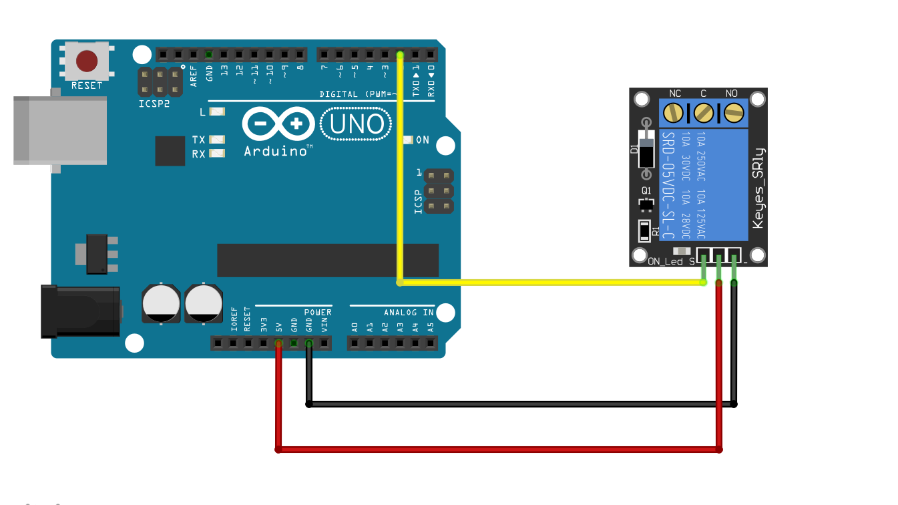
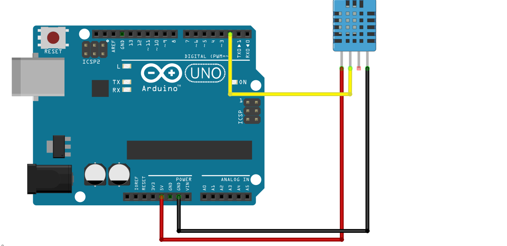

# ETAI-2021---VSSUT-11th-aug-iot-session
Official Repo of my session in a 1-week national level  ATAL Faculty Development Programme ETAI 2021 - VSSUT 

# About Speaker

<b>Madhu Parvathaneni alias MS </b>is a IoT Sloutions Architect at madBlocks IoT Group and Director & Strategist at Madblocks Technologies Pvt Ltd. He has 10+ years of experience in building IoT products from prototype stage to production stage. He trained more than 1.8 lakh students and 10K+ faculties across India on various cutting-edge technologies like IoT, Machine Learning, Cloud Computing, Augmented and Virtual Reality, Robotics, Blockchain etc...

# Schematics
<b>Arduino Relay </b>    

  
<b>DHT11 with Arduino </b>  

# Session - 2

<b>AWS IoT </b>

1. Connecting a sensor with Arduino Uno
2. Reading data from sensor using Arduino Uno
3. Pushing data to Raspberry Pi 
4. Creating an EC2 Instance on AWS 
5. Deploying MQTT Broker on AWS
6. Pushing Data to AWS IoT

# Session - 3

<b>Processing Data on AWS IoT </b>
1. Storing Data in Mongo DB 
2. Converting Data into a Dataset
3. Training a KNN Classification Model on Dataset
4. Sending SNS Notification

# Hardware
1. Arduino Uno with USB Cable
2. DHT11 Sensor
3. Relay with Bulb 
4. Raspberry Pi or Linux Desktop

# Software
1. Arduino Software (<a href="https://arduino.cc">Download Here</a>)
2. Fritzing Software for Schematic Design(<a href="https://onedrive.live.com/?authkey=%21AJ4yupk5PGV2vs0&cid=56559D033B70DDA3&id=56559D033B70DDA3%21929397&parId=56559D033B70DDA3%211006996&action=locate">Download Here</a>)
3. AWS (<a href="https://aws.amazon.com/free">AWS Amazon Free Tier</a>)

sudo apt-get install fritzing  (Linux)  
sudo brew install fritzing (mac OS)  

# Process to be done on AWS

1. sudo apt-get update 
2. sudo apt-get upgrade -y
3. sudo apt-get install mosquitto -y
4. sudo apt-get install mongodb -y
5. sudo apt-get install python3-pip -y
6. sudo pip3 install paho-mqtt

# Protocols
1. MQTT 
2. MQTT Broker (<a href="https://mosquitto.org">Mosquitto Broker</a>)

# Contact
Madhu Parvathaneni  
mad@madblocks.tech  
Linkedin: <a href="https://linkedin.com/in/MadhuPIoT">Access my Profile Here </a>  
Mobile/WhatsApp: 0-7893015625
